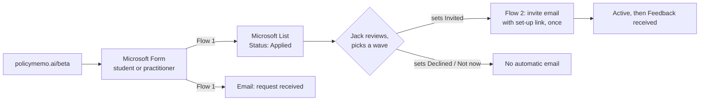

# Contributing

For people working on policymemo.ai rather than using it. Users want the
[README](README.md) or the [install page](https://policymemo.ai/install/).

## Where things live

| Folder | What it is | Edit by hand? |
|---|---|---|
| `skills/` | The 11 runtime skills. The only copy; everything else is generated from them or points at them | Yes |
| `reference/` | The method layer, sources, domain material, `AUTHORING.md` and `BEHAVIOUR_SPEC.md` | Yes |
| `evals/` | What testers actually saw, and the wiki distilled from it. Start at `evals/README.md` | Yes |
| `site/` | Sources for policymemo.ai: `beta/`, `blog/`, `install/`, `updates/` | Yes |
| `ports/` | The hand-written core of the Copilot and Gemini versions | Yes |
| `tools/` | Build scripts | Yes |
| `docs/` | The published website (GitHub Pages). Mostly generated from `site/` | Only `index.html`, icons, images |
| `dist/` | Downloads: zips and ports | **Never** |

## Working on the skills

```bash
git clone https://github.com/Policy-Analysis-Tools-for-Everyone/policymemo
cd policymemo
claude --plugin-dir .
```

That loads all 11 skills from `skills/` without installing anything.
[`reference/AUTHORING.md`](reference/AUTHORING.md) is the contract for writing or
revising one. The 2 rules most often broken are *no document-shaped replies* and
*do not restate the house rules*.

A new skill has to be added to the relevant plugin entry in
`.claude-plugin/marketplace.json`, or it won't ship. There's no default scan to
fall back on.

## Building

CI rebuilds everything on push to `main`. To build locally:

```bash
python3 tools/build-zips.py    # dist/skills/ and dist/download/, from skills/ and marketplace.json
python3 tools/build-ports.py   # dist/ports/, from skills/ and ports/core.md
python3 tools/build-site.py    # docs/, from site/ (needs: pip install markdown)
```

If `house-rules` has changed, `build-ports.py` stops on purpose until
`ports/core.md` has been checked against it. Then run it with `--accept-house-rules`.

## Releasing a version

The version lives in `.claude-plugin/marketplace.json`, on both entries. Every
build script reads it from there. The one exception is the line under the
Download button in `docs/index.html`, which is hand-written. Add an entry to
`site/updates/changelog.md`, then run all three builds.

Bump the version for every release. Testers can't report which version they ran
otherwise, and the evals are split by version.

## Packaging

`.claude-plugin/marketplace.json` lists 2 plugin entries, both drawing from
`skills/`. `mdee` carries `house-rules` and the 10 policy capabilities, and is what
the public installs. `mdee-evaluation` carries `house-rules` and `evaluation`, so
that people doing policy work don't carry a capability aimed at people maintaining
the agent. `reference/AUTHORING.md` section 12 has the detail, including why the
source is `./skills` and not the repository root.

Each skill is a `SKILL.md` with spec-compliant frontmatter, so they also work
through the Skills API. If you put several into one system prompt, put
`house-rules` first.

The Microsoft 365 Copilot and Google Gemini versions are generated into
`dist/ports/`. See [`ports/README.md`](ports/README.md).

## How house-rules reaches the other capabilities

Claude chat has no always-on instruction layer that ships with an add-on. So each
capability skill opens by telling Claude to load `house-rules` first and treat it
as binding. Each also carries the 2 rules that would be catastrophic if it were
missing: invent nothing, and the user decides.

That line is load-bearing. Copy it verbatim into any new skill. Part 0 of
`evals/tests/capability-pack.md` tests whether it's actually working.

## What sits behind the skills

**The method layer**, `reference/methods/`, is canonical: 10 capability methods
and 3 shared methods, written for maintainers. Every skill names the method file
it is grounded in. Shared methods are not extra steps: a skill carries the
distilled part it needs and calls nothing at runtime. See
[`reference/methods/README.md`](reference/methods/README.md).

**The writing layer**, `skills/story/writing.md`, is the output-quality
specification for everything the agent writes. It ships with `story`, which
applies it in full to documents. `house-rules` carries the part that holds in
every reply.

**Sources and domain material.** `reference/sources/README.md` lists every source
the method layer cites. `reference/domain/` holds domain-specific material, such
as the digital public infrastructure synthesis of 2 UCL IIPP papers. No skill
reads either.

[`reference/BEHAVIOUR_SPEC.md`](reference/BEHAVIOUR_SPEC.md) specifies the core
behaviour: the rules that hold in every conversation, and how the agent defines a
problem. Every other capability is specified by its method file.

### Provenance

Every skill carries a sourcing header naming its canonical method and what it is
**not** grounded in. A skill with an empty "not grounded" line is either very well
sourced or not being honest.

| Key | Source |
|---|---|
| `[B]` | Bardach, *A Practical Guide for Policy Analysis*, the main analytical spine |
| `[T]` | Donahue, "Strategic Alignment for Policy Analysis and Design", HKS Case 2090.0 |
| `[P]` | Product decisions recorded in `reference/BEHAVIOUR_SPEC.md` |
| `[O]` | Material the project owner authored directly |
| `[E]` | Behavioural evidence from saved sessions |

The method files set out their sources' ideas in this project's own words, with
citations. No third-party text is reproduced beyond short attributed examples.

## Evaluation

`evals/` is the improvement loop: raw reports from testers, a wiki that distils
them into findings, and test cases. [`evals/README.md`](evals/README.md) says how
to add a report and re-mine the wiki. Read
[`evals/wiki/findings.md`](evals/wiki/findings.md) first.

Run real sessions in the configuration you ship: an ordinary Claude chat with the
plugin installed. Running one in Claude Code measures a runtime no user has.
**Nothing about a tester ever reaches policymemo.ai during a session.**

## The website and the private beta

policymemo.ai is a static site served by GitHub Pages from `docs/`.
`tools/build-site.py` generates most of it from `site/`.

| Address | What it's for | Source |
| --- | --- | --- |
| `/` | Product home | `docs/index.html`, hand-written apart from generated links |
| `/beta` | How to join the private beta | `site/beta/body.html`, with links in `site/beta/config.json` |
| `/install` | Set-up instructions, linked from invite emails | `site/install/` |
| `/updates` | Plain changelog, newest first | `site/updates/changelog.md` |
| `/blog` | Notes. Linked from the footer, not the nav | `site/blog/posts/` |

Essays and reflection are published on
[CIVICWORKS](https://civicworks.substack.com/s/policymemoai), not on policymemo.ai.

Beta access is gated by a person, not by the site. Submitting a form never grants
access. The repository and `/install` are public, so this controls who is invited
and supported, not who can install.



[`site/beta/README.md`](site/beta/README.md) has the operational detail: the list
columns, the form questions, both Power Automate flows, the email templates and
how to run a wave. Feedback that comes back from a wave goes into
`evals/raw/beta/`; `evals/README.md` says how.
